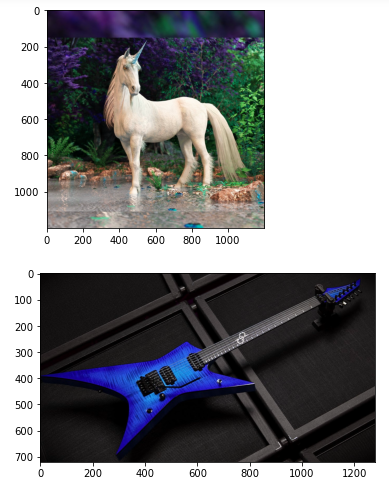
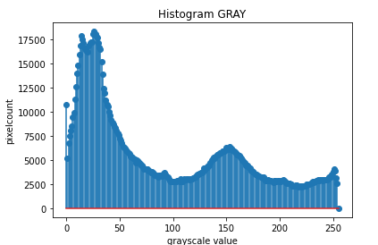
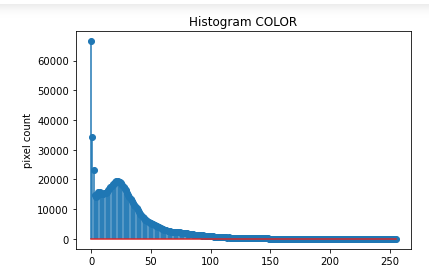

# Histogram and Histogram Equalization of an image
## Aim
To obtain a histogram for finding the frequency of pixels in an Image with pixel values ranging from 0 to 255. Also write the code using OpenCV to perform histogram equalization.

## Software Required:
Anaconda - Python 3.7

## Algorithm:
### Step1:

Import the open cv2 library.

### Step2:

Read the gray and color image using imread()

### Step3:

Use calcHist() function to mark the image in graph frequency for gray and color image.

### Step4:

cv2.equalize() is used to transform the gray image to equalized form.

### Step5:


print the program.

## Program:
```python
# Developed By:V.NAVYA
# Register Number:212221230069


# Write your code to find the histogram of gray scale image and color image channels.

import cv2
import matplotlib.pyplot as plt

gray = cv2.imread('a1.jpg')
color= cv2.imread('a2.jpg')
plt.imshow(gray)
plt.show()
plt.imshow(color)
plt.show()


# Display the histogram of gray scale image and any one channel histogram from color image


gray_hist = cv2.calcHist([gray],[0],None,[256],[0,255])
plt.figure()
plt.title("Histogram GRAY")
plt.xlabel("grayscale value")
plt.ylabel("pixelcount")
plt.stem(gray_hist)
plt.show()

color_hist = cv2.calcHist([color],[1],None,[256],[0,256])
plt.figure()
plt.title("Histogram COLOR")
plt.xlabel('color value')
plt.ylabel('pixel count')
plt.stem(color_hist)
plt.show()


# Write the code to perform histogram equalization of the image. 


import cv2
gray=cv2.imread('a1.jpg',0)
equ = cv2.equalizeHist(gray)
cv2.imshow('GRAY IMAGE',gray)
cv2.imshow('EQUALIZED IMAGE',equ)
cv2.waitKey(0)
cv2.destroyAllWindows()


```
## Output:
### Input Grayscale Image and Color Image



### Histogram of Grayscale Image and any channel of Color Image






### Histogram Equalization of Grayscale Image
 


## Result: 
Thus the histogram for finding the frequency of pixels in an image with pixel values ranging from 0 to 255 is obtained. Also,histogram equalization is done for the gray scale image using OpenCV.
